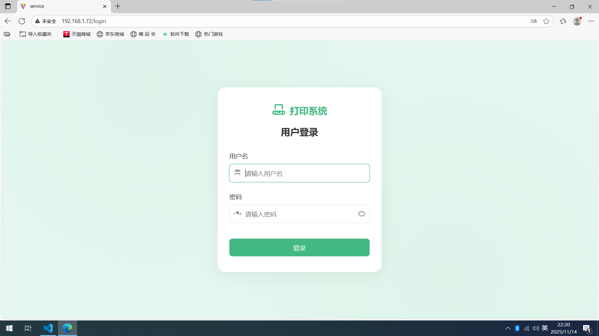
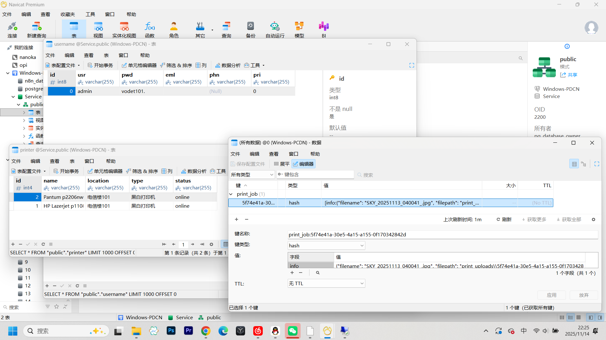

# EThink 打印页面维护手册

vite 应用的模板，后端主页如图所示，位于 __http://[ip]:[port]/__ 中，属于检测性质的页面，如果这个页面能正常显示，说明后端 WSGI 服务器正常运行，这个服务器用于处理后端的各种事务，比如打印、处理API、数据库连接等

内置了一个简单的登录页面，注册新用户直接在 PostgreSQL 中添加就可以，请注意 PgSQL 的端口在 5432，Redis 的端口在 6379，都可以局域网访问（我本身就是全部远程连接进行配置的）

同时还有最基本的登陆页面，基本中的基本了，账号 admin，密码自己配置

我建议用外面的 Navicat 对数据库进行访问，实在没有的话也可以去 D 盘编辑就是了

添加打印机或者用户什么的都类似的进行操作就可以了，都是遍历列表的，不过可能要修改一下后端去适配驱动就是了

这个就是我们的打印主界面

同时还适配了手机端的页面，为什么不用小程序是因为小程序属于微信本地网页子服务，与我们的后端连接的话需要一个公网IP，这显然是不合适的。

手机版图片看起来有点大，自己访问一下就知道了，总而言之言而总是剩下的就是怎么向里面添加新的打印机驱动，首先我们先明白程序是怎么运作的，程序由 Redis 进行高速数据存取，PgSQL 基本是作为一个管理数据库，但是因为没有多用户，我也没有写统计打印操作的数据库操作，之后可以加上。每次我们前端以 Client 身份访问我们的 Server 的时候就会向 Redis 插入数据报文，我们的 Worker process 只有一个，它会阻塞式地访问 Redis 并查询是否有可以打印的内容，如果查询到就跳转到我们的模拟打印函数内，本函数可以随意维护

至于其他的请不要动，尤其是不要动 Nginx、Redis 的配置文件，别的还好说一下，你只需要把新打印机的驱动写到上面就可以了，而且我们传过来的信息也是比较丰富的，就像这样

这是一组真实存在的数据，pending 表示它现在处于阻塞状态，你只需要根据他的 file_type（image或者pdf）、copies（打印份数）、printer_id（打印机序号）、print_mode（单/双面打印）、color_mode（黑白/彩色打印）进行对应的操作就可以了，Python 可以直接通过 sys 库调用 cmd 写什么都行，最终的绝对路径在 D:\Code\Python\WSGI\print_uploads 中做缓存

启动任务在 D:\Nanoka\startup.bat 不要乱改，尤其是启动顺序不要乱搞
